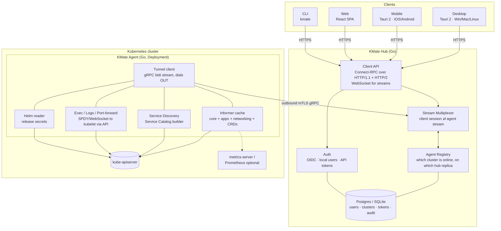
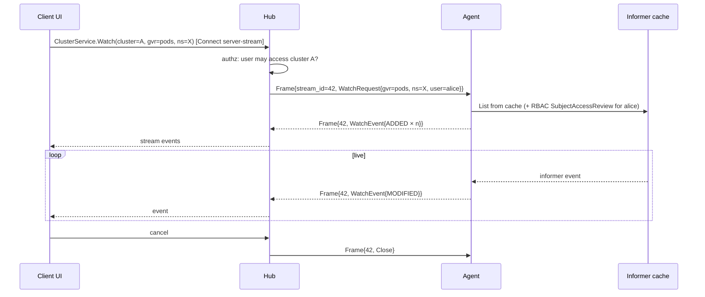

# 01 · System Architecture

## Components



### KMate Agent
- Single static Go binary, distroless image, runs as a `Deployment` (1 replica; HA via
  leader election in a later phase).
- Uses `client-go` informers with a shared factory. Keeps an in-memory cache and
  serves list/watch from that cache, so a client opening the pods view does not
  trigger a `LIST` on the API server.
- Opens **one** gRPC bidirectional stream to the Hub (`AgentService.Tunnel`). All
  traffic (requests, watch events, log bytes, exec frames) is multiplexed on it as
  `Frame` messages with a `stream_id`.
- Reconnects with jittered backoff. Stream resumption re-syncs watches from cache.
- Discovers Services, Ingresses, Gateway API routes and maintains the Service
  Catalog (see [05-service-discovery.md](05-service-discovery.md)).
- Enforces RBAC: every request carries the user identity from the Hub; the agent
  performs the Kubernetes call with `Impersonate-User` / `Impersonate-Group` headers.
  If the agent's ServiceAccount lacks `impersonate`, it falls back to its own identity
  and the Hub marks the cluster as "shared identity".

### KMate Hub
- Go service. Two listeners:
  - **Agent port (9090)**: gRPC + mTLS. Agents authenticate with a per-cluster
    enrollment token on first connect, then with an issued client certificate.
  - **Client port (8080)**: Connect-RPC (works from browsers, gRPC-compatible),
    plus WebSocket for terminal/log streams where HTTP/2 is unavailable (mobile
    proxies, corporate MITM).
- Stateless request routing. Cluster→hub-replica mapping stored in DB / Redis for
  multi-replica deployments (phase 5).
- Persists users, orgs, clusters, enrollment tokens, RBAC bindings and an audit log.
- Never stores kubeconfigs. Never has direct API-server access.

### Clients
- **Shared UI**: `apps/web` — React 19, TypeScript, Vite, TanStack Query/Router,
  Zustand, xterm.js, Monaco. Talks to the Hub via generated Connect-ES clients.
- **Desktop**: Tauri 2 wraps the same UI. Native menu, tray, keychain for tokens,
  local kubeconfig import as a *convenience* to auto-install the agent.
- **Mobile**: Tauri 2 mobile targets. Responsive layout of the same UI, plus push
  notifications (phase 6) and biometric unlock.
- **Web**: same SPA served by the Hub at `/`.

## Request flow example: "show me pods in namespace X"



## Request flow example: "exec into pod"

```mermaid
sequenceDiagram
    participant UI as xterm.js
    participant Hub
    participant Agent
    participant API as kube-apiserver
    UI->>Hub: WebSocket /v1/clusters/A/exec (pod, container, cmd)
    Hub->>Agent: Frame{stream_id=77, ExecOpen}
    Agent->>API: POST .../exec (SPDY/WebSocket, impersonating user)
    par bidirectional
        UI-->>Hub-->>Agent-->>API: stdin bytes
        API-->>Agent-->>Hub-->>UI: stdout/stderr bytes
    end
    UI->>Hub: resize / close
```

## Data ownership

| Data | Lives in | Notes |
|------|----------|-------|
| Cluster resource state | Agent memory (informer cache) | Never persisted by KMate |
| Service Catalog | Agent memory, snapshot pushed to Hub on change | Hub keeps last snapshot for offline display |
| Users, orgs, cluster registrations, tokens | Hub DB | Postgres in prod, SQLite for dev / single-user |
| Audit log (who did what on which cluster) | Hub DB | Also forwarded to stdout as JSON |
| Client preferences | Client local storage / keychain | |

## Scaling model

- One agent per cluster. Agent memory is proportional to cluster size (same as
  any informer-based controller). Namespace-scoped mode for very large clusters.
- Hub replicas behind a load balancer. Agent stream stickiness by design (an agent
  is connected to exactly one replica). Cross-replica routing via a shared
  registry (Redis pub/sub or Postgres LISTEN/NOTIFY) — phase 5.
- Clients are thin; they hold only what is on screen.

## Technology choices (see ADRs)

| Concern | Choice | ADR |
|---------|--------|-----|
| Agent & Hub language | Go | [0001](adr/0001-go-for-backend.md) |
| Agent connectivity | Outbound gRPC bidi stream | [0002](adr/0002-agent-based-outbound-tunnel.md) |
| Client API | Connect-RPC (+ WebSocket for terminals) | [0003](adr/0003-connect-rpc-client-api.md) |
| UI framework | React + TypeScript, single codebase | [0004](adr/0004-single-ui-codebase.md) |
| Desktop & mobile shell | Tauri 2 | [0005](adr/0005-tauri-for-desktop-and-mobile.md) |
| Hub DB | Postgres (prod) / SQLite (dev) | [0006](adr/0006-hub-database.md) |
| UI component kit | shadcn/ui + Hirael | [0007](adr/0007-shadcn-hirael-ui-kit.md) |
