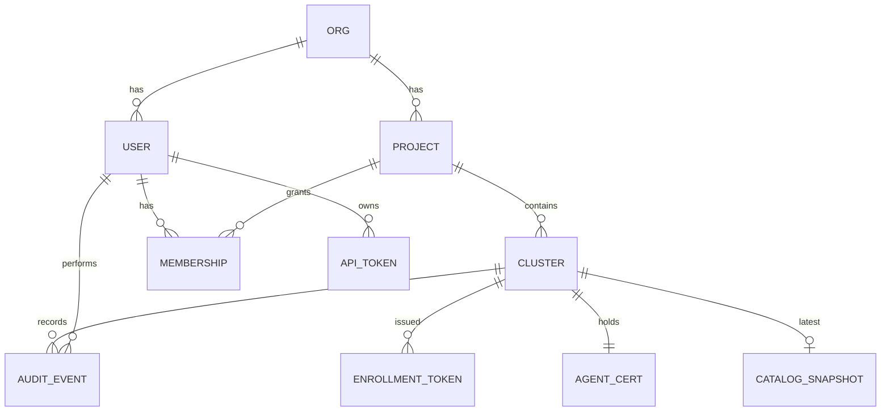

# 03 · KMate Hub

The Hub is the control plane and relay. It is the only thing clients talk to and the
only thing agents talk to.

## Responsibilities

1. **Identity**: local users (dev/small teams), OIDC (Google, GitHub, Okta, Entra), API tokens for CLI/CI.
2. **Cluster registry**: enrollment tokens, agent certificates, online/offline state, last heartbeat, cluster metadata.
3. **Authorization**: org → project → cluster membership; roles `viewer`, `operator`, `admin`. Maps a KMate user to a Kubernetes identity (`user`, `groups`) for impersonation.
4. **Routing**: client request → correct agent stream → response/stream back.
5. **Persistence**: users, orgs, clusters, tokens, audit, last Service Catalog snapshot per cluster.
6. **Serving the web UI** (static SPA) and, later, mobile push notifications.

## Ports & protocols

| Port | Protocol | Peer |
|------|----------|------|
| 8080 | HTTP/1.1 + HTTP/2, Connect-RPC (`/kmate.v1.ClusterService/*`), WebSocket (`/ws/...`), static UI | Clients |
| 9090 | gRPC over mTLS (`kmate.v1.AgentService`) | Agents |
| 9091 | HTTP `/metrics`, `/healthz` | Ops |

Both public ports should sit behind TLS termination (or use the built-in
autocert / provided certs). The agent port additionally requires **client certs**
issued by the Hub CA after enrollment.

## Data model



## Internal structure

```
cmd/kmate-hub/main.go
internal/hub/
  server/        HTTP + gRPC listeners, middleware (auth, logging, CORS)
  auth/          sessions, OIDC, local password, API tokens, JWT issuance
  registry/      in-memory agent connection table + DB-backed cluster records
  relay/         frame multiplexer: client streams ⇄ agent tunnel
  api/           ClusterService, HubService implementations (Connect)
  store/         sqlc/ent-based persistence (SQLite + Postgres)
  ca/            internal CA for agent certificates
  audit/         audit writer
  web/           embed.FS of built SPA
```

## Relay design

Each connected agent has a `Tunnel` object with:
- `send chan *Frame` (writer goroutine)
- `streams map[uint32]*Stream` with per-stream inbound channel and credit window
- `OpenStream(ctx) (*Stream, error)` used by API handlers

A client `Watch` call becomes:
1. authz check
2. `tunnel.OpenStream()` → stream id
3. send `WatchRequest` frame
4. pump inbound frames → Connect server-stream until client ctx is cancelled
5. send `Close` frame, free stream id

Backpressure: if the client is slow, the relay stops sending `WindowUpdate` to the
agent, which stops reading from the informer channel (events coalesce in cache; the
client gets the latest state, never a backlog).

## Multi-replica (phase 5)

- Registry entry `cluster_id → hub_replica_id` in Redis with TTL refreshed by heartbeat.
- Replica receiving a request for a cluster it doesn't own forwards over an
  internal gRPC hop (`RelayService.Forward`). One hop max.

## Configuration

| Env | Meaning |
|-----|---------|
| `KMATE_DB_URL` | `sqlite://kmate.db` or `postgres://...` |
| `KMATE_PUBLIC_URL` | e.g. `https://kmate.example.com` (used in OIDC redirects, enrollment commands) |
| `KMATE_AGENT_ADDR` | advertised agent endpoint `kmate.example.com:9090` |
| `KMATE_TLS_CERT/KEY` | optional; else `KMATE_INSECURE=true` for dev |
| `KMATE_OIDC_*` | issuer, client id/secret |
| `KMATE_ADMIN_EMAIL/PASSWORD` | bootstrap admin (dev) |

## API surface (client-facing, Connect)

- `HubService`: `Login`, `Me`, `ListClusters`, `CreateCluster` (returns enrollment
  token + `helm install` command), `DeleteCluster`, `ListAuditEvents`.
- `ClusterService` (all take `cluster_id`): `Discover` (API groups/resources),
  `List`, `Get`, `Watch` (server stream), `Apply`, `Patch`, `Delete`, `Scale`,
  `RolloutRestart`, `Logs` (server stream), `GetCatalog`, `WatchCatalog`, `ListHelmReleases`, `GetMetrics`.
- WebSocket: `/ws/clusters/{id}/exec`, `/ws/clusters/{id}/portforward`, `/ws/clusters/{id}/watch`.

### Multiplexed watches: `GET /ws/clusters/{id}/watch`

Browsers cap plain-HTTP connections at six per origin and each Connect server-stream
holds one, so a page with many live tables (or the Realm view with eleven kinds)
starves itself. All resource watches from a browser therefore share **one WebSocket per
cluster**. The Connect `ClusterService.Watch` RPC stays for the CLI and as a fallback.

Auth: `Authorization: Bearer` header or `?token=` query parameter. Text frames, JSON.

| Direction | Message |
|---|---|
| client → hub | `{"op":"sub","id":"w1","gvr":{"group":"","version":"v1","resource":"pods"},"options":{"namespace":"","labelSelector":"","fieldSelector":"","columnsOnly":true}}` |
| client → hub | `{"op":"unsub","id":"w1"}` |
| hub → client | `{"id":"w1","type":"SYNC","object":{…}}` × n, then `{"id":"w1","type":"SYNC","synced":true}`, then live `ADDED` / `MODIFIED` / `DELETED` / `ERROR` events with `object` and/or `error` |
| hub → client | `{"id":"w1","type":"CLOSED","error":{…}}` when the agent-side stream ends (cluster offline, RBAC…); the client re-subscribes with backoff |

Each `sub` opens one relay stream to the agent with the caller's identity (same path as
the RPC). Limits: 64 subscriptions per socket, a single writer goroutine with a 4096-message
backlog; a client that cannot drain for 10 s is closed with `slow consumer`. Ping every 20 s.
Metrics: `kmate_hub_watch_sockets`, `kmate_hub_watch_subscriptions` on `:9091/metrics`.
- HTTP port-forward proxy (web/mobile, no local listener needed):
  `ANY /pf/{clusterId}/{namespace}/{pod}/{port}/{rest...}`. Auth by bearer header,
  `?token=`, or the `kmate_pf` cookie set by `POST /pf/session` (bearer → HttpOnly
  cookie scoped to `/pf/`, 1 h; `DELETE /pf/session` clears it). Each request opens one
  port-forward stream to the agent, writes the raw HTTP request (Host rewritten,
  `Connection: close`, hub cookies stripped, `X-Forwarded-Prefix` set) and streams the
  response back. Every request is audit-logged.
  Limits: plaintext HTTP to the pod only; no WebSocket upgrade passthrough; apps that
  use absolute paths or absolute-path redirects will not resolve under the `/pf/`
  prefix. Good for admin UIs and APIs, not a general reverse proxy.
- `ClusterService.GetHelmRelease` relays `helm_get` (values, manifest, notes, history).
- `GetMetrics` returns `unimplemented` with an explanatory message when the cluster has
  no `metrics.k8s.io` API.
