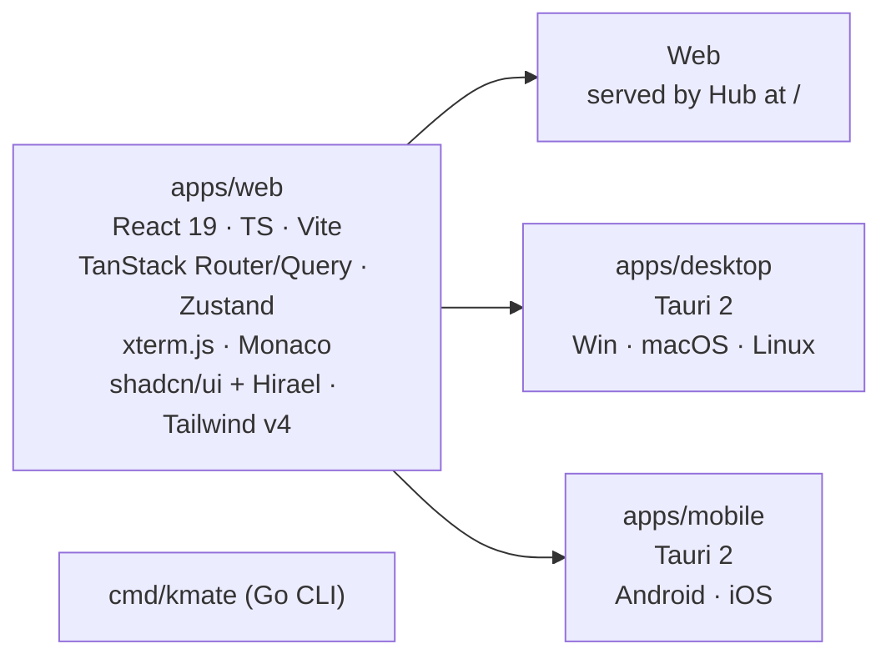

# 04 · Clients (Web · Desktop · Mobile · CLI)

## One codebase

All graphical clients are the **same React application** (`apps/web`). Platform
shells only add native capabilities.



## Feature matrix

| Feature | Web | Desktop | Mobile |
|---------|-----|---------|--------|
| Cluster list, health, switch | ✓ | ✓ | ✓ |
| Service Catalog dashboard (ingress URLs) | ✓ | ✓ | ✓ |
| Workloads / Config / Network / Storage / RBAC / CRDs browsing | ✓ | ✓ | ✓ (responsive) |
| Live watch | ✓ | ✓ | ✓ |
| Logs viewer (follow, search, multi-container) | ✓ | ✓ | ✓ |
| YAML editor with server-side apply | ✓ | ✓ | read-only + quick actions |
| Exec terminal (xterm) | ✓ | ✓ | ✓ (soft keyboard bar) |
| Port-forward to localhost | via Hub HTTP proxy | ✓ native | via Hub HTTP proxy |
| Scale / restart / delete | ✓ | ✓ | ✓ with confirm + biometric |
| Helm releases | ✓ | ✓ | ✓ |
| Metrics charts | ✓ | ✓ | ✓ |
| Token storage | memory + httpOnly cookie | OS keychain | Secure Enclave / Keystore |
| Push notifications (pod crash, deploy failed) | – | OS notifications | ✓ (phase 6) |
| Auto-install agent from local kubeconfig | – | ✓ | – |
| Offline: last catalog snapshot | ✓ | ✓ | ✓ |

## UI information architecture

```
/                        cluster picker (cards: name, k8s version, nodes, pods, status, catalog count)
/c/:cluster              Overview: Service Catalog dashboard (default landing)
/c/:cluster/catalog      Service Catalog (full table + filters)
/c/:cluster/workloads    pods · deployments · statefulsets · daemonsets · jobs · cronjobs
/c/:cluster/config       configmaps · secrets (masked) · hpa · pdb · resourcequota · limitrange
/c/:cluster/network      services · ingresses · gateways/httproutes · endpoints · networkpolicies
/c/:cluster/storage      pvc · pv · storageclasses
/c/:cluster/access       serviceaccounts · roles · bindings
/c/:cluster/crds         custom resource definitions → dynamic table per CRD
/c/:cluster/helm         releases
/c/:cluster/nodes
/c/:cluster/events
/c/:cluster/r/:gvr/:ns/:name   resource detail drawer: summary · YAML · events · logs · terminal · metrics
/settings                account · tokens · hub · appearance
```

Mobile uses the same routes; the sidebar becomes a bottom tab bar
(Overview · Workloads · Network · Logs · More), tables become cards.

## Component kit

shadcn/ui (Radix) + [Hirael](https://hirael.com) components vendored via the shadcn CLI. See [ADR 0007](adr/0007-shadcn-hirael-ui-kit.md). Theme tokens live in `apps/web/src/index.css`; dark mode uses the `.dark` class.

## State & data layer

- Generated **Connect-ES** client from `proto/`. One `HubClient` and per-cluster
  `ClusterClient` instances.
- `useWatch(gvr, ns)` hook: subscribes through `watchMux.ts`, which keeps **one
  WebSocket per cluster** (`/ws/clusters/{id}/watch`) carrying every resource watch on the
  page; maintains a normalized map `uid → object` in Zustand, exposes a sorted list.
  Reconnects with backoff and re-subscribes (stores reset, then a fresh SYNC arrives).
  Falls back to one Connect server-stream per watch if the socket cannot be opened.
  Why: browsers cap plain HTTP at six connections per origin and each Connect stream holds one.
- Tables are virtualized (TanStack Virtual). 10k pods should scroll smoothly.
- Terminal & logs use raw WebSocket to the Hub (binary frames).

## Desktop shell (Tauri 2)

- Rust side: keychain plugin, single-instance, deep link `kmate://`, auto-update,
  local port-forward listener (Rust TCP listener bridged to the Hub WebSocket).
- "Add cluster from kubeconfig" wizard: reads kubeconfig, runs the Helm chart
  install using the embedded Helm SDK via a sidecar Go binary (`kmate` CLI).

## Mobile shell (Tauri 2)

- iOS ≥ 16, Android ≥ 10.
- Biometric gate before write actions.
- Background: none (no persistent connections). Push notifications originate from
  the Hub (APNs / FCM) in phase 6.

## CLI (`cmd/kmate`)

- `kmate login <hub>`, `kmate clusters`, `kmate get pods -c prod -n app`,
  `kmate logs`, `kmate exec`, `kmate port-forward`, `kmate agent install --kubeconfig ...`.
- Talks Connect to the Hub. Never needs a kubeconfig except for `agent install`.
