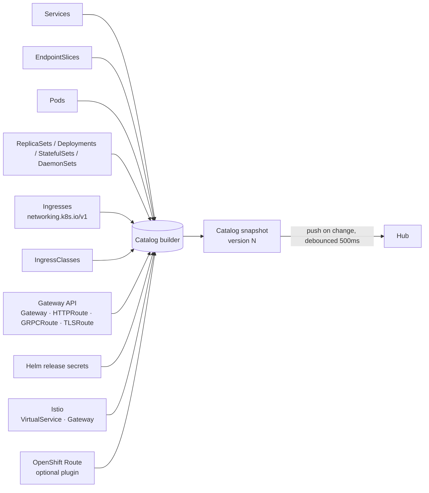

# 05 · Service Auto-Discovery & Ingress Dashboard

The differentiating feature. The agent turns raw Kubernetes objects into a
**Service Catalog**: a list of *logical services* with everything a human wants to
know about them on one card.

## What a Catalog entry contains

```jsonc
{
  "id": "default/shop-frontend",
  "namespace": "default",
  "name": "shop-frontend",
  "type": "ClusterIP",                     // ClusterIP | NodePort | LoadBalancer | ExternalName | Headless
  "ports": [{ "name": "http", "port": 80, "targetPort": 8080, "protocol": "TCP", "appProtocol": "http" }],
  "selector": { "app": "shop-frontend" },
  "workloads": [                           // resolved via selector → pods → ownerRefs
    { "kind": "Deployment", "name": "shop-frontend", "ready": 3, "desired": 3 }
  ],
  "endpoints": { "ready": 3, "notReady": 0 },
  "health": "Healthy",                     // Healthy | Degraded | Down | Unknown | NoSelector
  "exposure": [                            // every way this service is reachable from outside
    {
      "kind": "Ingress", "name": "shop", "class": "nginx",
      "host": "shop.example.com", "path": "/", "pathType": "Prefix",
      "tls": true, "url": "https://shop.example.com/",
      "lbAddresses": ["203.0.113.10"]
    },
    {
      "kind": "HTTPRoute", "name": "shop-route", "gateway": "infra/public-gw",
      "host": "shop.example.com", "path": "/api", "tls": true, "url": "https://shop.example.com/api"
    },
    {
      "kind": "VirtualService", "name": "shop", "class": "istio-system/public-gateway",
      "host": "shop.example.com", "path": "/", "tls": true, "url": "https://shop.example.com/",
      "addresses": ["203.0.113.10"]
    },
    { "kind": "LoadBalancer", "url": "http://203.0.113.11:80" },
    { "kind": "NodePort", "url": "http://<node-ip>:31080" }
  ],
  "labels": { "app.kubernetes.io/part-of": "shop" },
  "annotations": { "kmate.io/description": "Storefront", "kmate.io/icon": "shopping-cart" },
  "helmRelease": "shop",
  "group": "shop",                         // from app.kubernetes.io/part-of, or Helm release, or namespace
  "lastChange": "2026-09-24T10:11:12Z"
}
```

## Sources & resolution



Resolution steps (recomputed incrementally on any input event):

1. **Service → pods**: apply `spec.selector` against the pod informer index (indexed by namespace+labels).
2. **Pods → workloads**: follow `ownerReferences` (Pod → ReplicaSet → Deployment, Pod → StatefulSet, etc.) and read ready/desired from the controller status.
3. **Endpoints health**: from EndpointSlices (`ready`, `serving`, `terminating` conditions). `Healthy` = ready ≥ 1 and ready == desired, `Degraded` = 1 ≤ ready < desired, `Down` = 0 ready with desired > 0, `NoSelector` for ExternalName / manual endpoints.
4. **Ingress exposure**: for each Ingress rule/path whose backend `service.name` matches, emit an exposure with `host`, `path`, `tls` (host listed in `spec.tls`), URL built as `scheme://host/path`. If host is empty use `status.loadBalancer.ingress[].ip|hostname`. Default backend counts too.
5. **Gateway API exposure**: `HTTPRoute.spec.rules[].backendRefs` naming the service → look up `parentRefs` Gateway → listeners give `hostname`, `port`, `protocol`, TLS; Gateway `status.addresses` gives IPs.
6. **Istio exposure** (when `networking.istio.io` CRDs exist): `VirtualService.spec.http[].route[].destination.host` naming the service (short name, `svc.ns`, `svc.ns.svc`, or FQDN) → `spec.hosts` give public hostnames, `spec.gateways` (`ns/name`, `name`, or `mesh`) → Istio `Gateway.spec.servers` decide scheme/port (HTTPS or a `tls` block ⇒ https; non-443 ports kept, e.g. `:8444`) via wildcard host matching; `Gateway.spec.selector` → ingress-gateway pods → LoadBalancer Service → `status.loadBalancer.ingress` for addresses. URI matches (`prefix`/`exact`) become paths. `mesh`-only routes are ignored.
7. **LoadBalancer / NodePort exposure** directly from the Service.
8. **Grouping**: `app.kubernetes.io/part-of` → Helm release → namespace.
9. **Annotations** `kmate.io/description`, `kmate.io/icon`, `kmate.io/url` (override), `kmate.io/hide: "true"` let teams curate the dashboard without touching KMate.

Cost: all lookups hit in-memory indexes; a change to one pod recomputes only the
services that select it.

## Dashboard (client)

- Default landing page per cluster.
- Card grid grouped by `group`; each card: icon, name, namespace, health dot,
  ready/desired, primary URL as a button (opens in browser / in-app webview on mobile),
  chips for extra exposures, Helm release badge.
- Filters: namespace, health, exposed-only, text search. Sort by name / health / last change.
- Card click → resource drawer (service YAML, endpoints, linked workloads, ingress objects, logs of backing pods).
- Quick actions: restart workload, scale, open URL, copy `kubectl port-forward` command.
- **Reachability probe (opt-in)**: agent performs an HTTP HEAD to each exposure URL from inside the cluster every 60 s and shows latency/status. Off by default because it generates traffic.

## System services

Namespaces `kube-system`, `kmate-system` and anything matching `values.catalog.hideNamespaces`
are collapsed under a "System" group and hidden by default.
