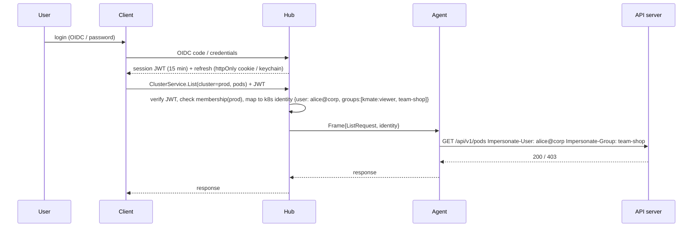

# 06 · Security Model

## Threat model summary

| Asset | Threat | Mitigation |
|-------|--------|------------|
| Cluster API access | Stolen client device | Clients hold only a short-lived Hub session token; no kubeconfig ever leaves the cluster. Tokens revocable at Hub. |
| Agent tunnel | MITM / rogue hub | Agent pins the Hub CA (from enrollment) and uses mTLS with its issued cert. |
| Agent | Rogue agent registering as another cluster | Enrollment token is single-use (or bounded), cluster identity bound to cert CN + kube-system namespace UID. |
| Hub | Compromised Hub | Hub has *no* cluster credentials. It can only ask an agent to do things, and the agent applies impersonation + RBAC. Blast radius = what agent SA can do. |
| Users | Privilege escalation | Hub roles + Kubernetes RBAC via impersonation. Write verbs off by default in Helm values. |
| Audit | Repudiation | Every mutating and exec/log request audit-logged at Hub with user, cluster, object, request id; forwarded to stdout/SIEM. |
| Secrets | Data exposure | Secret values masked in UI by default; reveal requires explicit action, audited, and can be disabled per cluster (`values.secrets.allowReveal=false`). |

## Identity flow

If impersonation isn't granted to the agent (Helm `rbac.impersonate=false`), the
agent uses its own identity and the Hub enforces only its own coarse roles. The UI
shows a "shared identity" badge on such clusters.

## Agent RBAC (Helm defaults)

- `rbac.read=true`: `get,list,watch` on `*.*` + non-resource `/metrics`, `/healthz`, `/version`.
- `rbac.write=false`: `create,update,patch,delete` on workloads/config/network/storage.
- `rbac.exec=false`: `pods/exec`, `pods/attach`, `pods/portforward`.
- `rbac.impersonate=false`: `impersonate` on `users`, `groups`, `serviceaccounts`.
- `rbac.secretsRead=true`: can be set false to exclude Secrets from the reader role entirely.

## Transport

- Client ⇄ Hub: TLS 1.2+, HSTS, CSP on the SPA.
- Agent ⇄ Hub: gRPC over TLS 1.3, mTLS, cert lifetime 30 days, auto-renewed at 2/3 lifetime over the existing tunnel.
- Enrollment token: `kmt_enr_<random 32B base64url>`, expires 24 h, single-use by default.

## Supply chain

- Distroless images, non-root, read-only rootfs, `seccompProfile: RuntimeDefault`.
- SBOM + cosign signatures on releases. Helm chart signed.
- Dependabot / Renovate.
