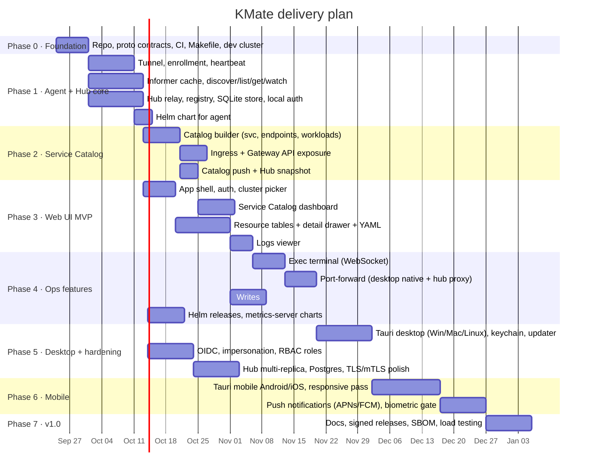

# 08 · Roadmap & Phases

Seven phases. Each phase ends with something runnable and demoable. Dates assume a
small team (2–3 engineers) starting 2026-09-24; adjust to headcount.

## Phase summaries

| Phase | Goal | Exit criteria | Doc |
|-------|------|---------------|-----|
| 0 | Foundation | `make proto && make build` green; kind cluster script | [phases/phase-0.md](phases/phase-0.md) |
| 1 | Agent + Hub core | Agent enrolls into Hub, `kmate get pods` via Hub works, live watch works — **done** | [phases/phase-1.md](phases/phase-1.md) |
| 2 | Service Catalog | Catalog JSON for a demo app shows ingress URLs and health — **done, incl. Istio** | [phases/phase-2.md](phases/phase-2.md) |
| 3 | Web UI MVP | Login → cluster → dashboard → pods → logs in browser — **done** | [phases/phase-3.md](phases/phase-3.md) |
| 4 | Ops features | exec, port-forward, edits, Helm, metrics — **done 2026-09-24** | [phases/phase-4.md](phases/phase-4.md) |
| 5 | Desktop + hardening | signed desktop builds; OIDC; multi-replica hub — in-cluster deployment on GKE done 2026-09-28, see [10-deploy-gke.md](10-deploy-gke.md) | [phases/phase-5.md](phases/phase-5.md) |
| 6 | Mobile | TestFlight + Play internal track builds; push notifications | [phases/phase-6.md](phases/phase-6.md) |
| 7 | v1.0 | public release | [phases/phase-7.md](phases/phase-7.md) |

## Realm View (parallel track, started 2026-09-29)

A fantasy-map visualisation of the cluster using the Cute Fantasy pixel-art packs.
Design and delivery steps R0–R4 live in [11-realm-view.md](11-realm-view.md); decision in
[ADR 0008](adr/0008-realm-view-pixijs.md). It runs alongside phase 5 and does not block it.

## Risks

| Risk | Impact | Mitigation |
|------|--------|-----------|
| Tauri mobile maturity | Mobile phase slips | Fallback: Capacitor wrapping the same SPA. Decide at start of phase 6. |
| Large clusters blow agent memory | Adoption on big prod clusters | Namespace scoping, `columns_only` projections, lazy CRD informers, memory metrics from day 1. |
| Corporate proxies block HTTP/2 / gRPC | Agent can't reach Hub | Agent supports gRPC-over-WebSocket fallback (phase 5). |
| Impersonation not granted | Coarse authz only | UI shows "shared identity" badge; docs push `rbac.impersonate=true`. |
| Scope creep toward "Lens parity" | Never ships | Phases are strict; extras go to backlog in `docs/backlog.md`. |
